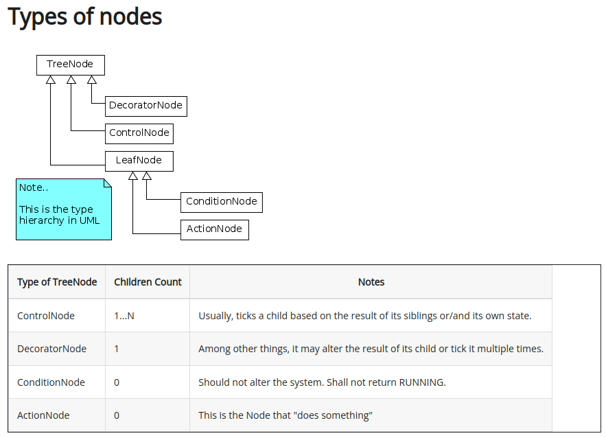

# BehaviorTree 
[BehaviorTree官方文档](https://www.behaviortree.dev/docs/intro)

[1. a introduction of BT](#1)
[2. XML schema](#2)

## 1. a introduction of BT
<p id=1></p>

行为树是控制“任务”执行流程的分层节点树
一个叫做“tick”的信号被发送到树的根部并在树中传播,直到到达叶节点
任何接收到"tick"信号的TreeNode都会执行其回调并返回:
 - SUCCESS
 - FAILURE
 - RUNNING

ActionNode: 
1. **synchronous node同步节点**
    阻塞树，直到返回SUCCESS或FAILURE
2. **asynchronous node异步节点**
    返回RUNNING,以传达action仍在执行中
    再次"tick",直到最终返回SUCCESS或FAILURE

> 1. 使用XML格式在运行时实例化树
> 2. 任何TreeNode都可看作是回调机制
> 3. 通过继承传建自定义节点
>   - ActionNodeBase
>   - ConditionNode
>   - DecoratorNode
> 4.
>   - **Blackboard**: a key/value storage shared by all the Nodes of a Tree
>   - **Port**: a mechanism that Nodes can use to exchange information between each other, connected using the same key of the blackboard
>   - 节点的数量、名称和端口类型必须在编译时已知，端口之间的连接在部署XML时完成，可以将任何C++类型存储为值

## 2. XML schema
<p id=2></p>

[这是一个BT的XML示例](./doc/firstBT1.xml)
> 每个TreeNode都由一个标签定义：
>   - ID：  标签的名字，用于在factory中注册
>   - name：【可选】引用实例的名称
>   - 端口是使用属性配置的
> 子节点的数量：
>   - ControlNode：包含多个子节点
>   - DecoratorNode：仅包含一个子节点
>   - ActionNode 和 ConditionNode：没有子节点
> 表示语法：
>   - compact紧凑表示：
> ``<SaySomething    name="action_hello" message="Hello"/> ``
>   - explicit显示表示：
> ``<Action ID="SaySomething"   name="action_hello" message="Hello"/> ``

1. include外部文件
```xml
<include path="relative_or_absolute_path_to_file">
```
2. 在ROS包中查找文件：
```xml
<include ros_pkg="name_package"  path="path_relative_to_pkg/grasp.xml"/>
```
