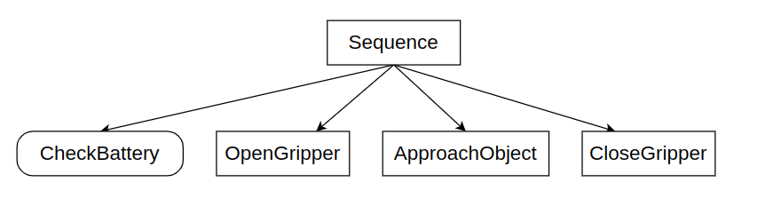

# BehaviorTree 
### Your First BT Tree
[BehaviorTree官方文档](https://www.behaviortree.dev/docs/tutorial-basics/tutorial_01_first_tree/)

- 通过继承的方式创建TreeNode
- TreeNode的任何实例都有一个name
- 方法tick是发生实际操作的地方，始终返回一个BT::NodeStatus(RUNNING、SUCCESS、FAILURE)
- XML中使用的标识符必须与用于注册TreeNode的标识符一致
