# 无人机系统

课程视频地址：[浙江大学博导 带你从0开始制作无人机](https://www.bilibili.com/video/BV1LY411e7ud/?spm_id_from=333.337.search-card.all.click&vd_source=8667a8fb4daf9baabef9688e2fb79c1f)

### 无人机硬件架构
1. **飞控**：飞行控制器，用于根据输入指令解算电机推力
    - 输入：遥控器、电机、舵机
    - IMU、气压计、磁罗盘
    - 接口：I2C、UART、CAN、GPS
2. **电调**：ESC电子调速器
    - 相当于电机驱动器
    - 四合一电调、分体电调
3. **无刷电机**
    - 选型：电机尺寸、适配桨寸、KV值
    - 电机转速（空载） = KV值 * 电压
    - 1. 3寸桨叶：KV6000
      2. 5寸桨叶：KV1750
      3. 7寸桨叶：KV1300
4. **锂电池**
    - 选型：电压（电芯数、）容量、放电倍率
    - 为电机、飞控、机载电脑等供电
5. **电压计（BB响）**：指示电池电压，并在低压时报警
6. **接收机**：为飞控接收遥控器信号
7. **遥控器**：发送控制信号给飞控来控制无人机
    - 选型：通道数
8. **GPS**：接收卫星信号为无人机定位
9. **舵机供电**
10. **监视器**
11. **云台相机**

**机架**：承载飞机主体部分
    - 选型：轴距、重量、可拓展性
    - 四轴机架、六轴机架、八轴机架、穿越机竞速机架、多旋翼机架、固定翼机架  
**机载电脑**
**传感器**：
    - USB摄像头、双目相机、激光雷达、光流传感器、追踪相机
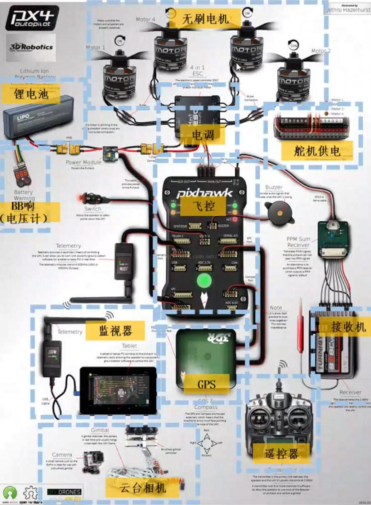

### 无人机软件架构
1. **传感器数据**（IMU、点云）  
2. **定位与建图** 
    - 定位：LIO、VIO、GPS、动作捕捉仪
    - 建图：点云地图、栅格地图、欧式距离场(ESDF)、八叉树地图
3. **运动规划**
    - **前端**：路径搜索、采样，飞行走廊生成
        - 路径搜索：Dijkstra、Astar、RRT、人工势场法
    - **后端**：轨迹优化
        - 轨迹优化：Minimun-Snap、SE(3)
4. **控制器**
    - 位置、速度闭环
    - 姿态控制

### 无人机控制算法
闭环系统：感知-规划-控制
1. **传感**
    - 感知：三维、稠密感知；地图维护；用于规划
2. **建图**、**定位**
    - 估计：低延迟、高精度、一致性
3. **规划**
    - 应对复杂、未知环境
    - 安全、动力学可行性
    - 有限的传感器和计算能力
4. **控制**
    - 高机动运动
    - 光滑轨迹跟踪
5. 悬停、跟踪、集群

飞控只负责对推力和姿态的跟踪

### 四旋翼飞行器动力学
- 电机模型：
$$ \dot{w_i} = k_m (w_i^{des} - w_i) $$
- 单个电机产生的推力：
$$ F_i = k_F w_i^2 $$
- 单个电机产生的力矩：
$$ M_i = k_M w_i^2 $$
- 旋转矩阵：Z-X-Y欧拉角（围绕机体系三个轴的旋转顺序）
$$ \pmb{R_{ab}} = \pmb{R_z(\psi)} · \pmb{R_x(\phi)} · \pmb{R_y(\theta)} = 
\begin{bmatrix}
c \psi c \theta & -c \phi s \psi & c \psi s \theta + c \theta s \phi s \psi \\
c \theta s \psi + c \psi s \phi s \theta & c \phi c \psi & s \psi s \theta - c \psi c \theta s \phi \\
-c \phi s \theta & s \phi & c \phi c \theta
\end{bmatrix}
$$
- 即时角速度与欧拉角的导数之间的转换：
$$
\begin{bmatrix} w_x \\ w_y \\ w_z \end{bmatrix} = 
\begin{bmatrix}
c \theta & 0 & -c \phi s \theta \\
0 & 1 & s \theta \\
s \theta & 0 & c \phi c \theta
\end{bmatrix}
\begin{bmatrix} \dot{\phi} \\ \dot{\theta} \\ \dot{\psi} \end{bmatrix}
$$
- 牛顿方程：
$$
m\ddot{\pmb{p^a}} = 
\begin{bmatrix} 0 \\ 0 \\ -mg \end{bmatrix} + 
\pmb{R_{ab}}
\begin{bmatrix} 0 \\ 0 \\ F_1 + F_2 + F_3 + F_4 \end{bmatrix}
$$
- 欧拉方程：
$$
\pmb{I^b} · \begin{bmatrix} \dot{w_x} \\ \dot{w_y} \\ \dot{w_z} \end{bmatrix} + 
\begin{bmatrix} w_x \\ w_y \\ w_z \end{bmatrix} \times \pmb{I^b} · \begin{bmatrix} w_x \\ w_y \\ w_z \end{bmatrix} = 
\begin{bmatrix} l(F_2 - F_4) \\ l(F_3 - F_1) \\ M_1 - M_2 + M_3 - M_4 \end{bmatrix}
$$
- 平面旋翼：
$$
\begin{bmatrix} \ddot{y} \\ \ddot{z} \\ \ddot{\phi} \end{bmatrix} = 
\begin{bmatrix} 0 \\ -g \\ 0 \end{bmatrix} +
\begin{bmatrix} 
-1/m\sin{\phi} & 0 \\
1/m\cos{\phi} & 0 \\
0 & 1/(I_{xx})
\end{bmatrix}
\begin{bmatrix} F \\ M \end{bmatrix}
$$

### 控制系统设计
- 开环控制
    - 以预先确定的方式移动机器人
- 闭环控制
    - 根据输出来调整机器人运动的输入（反向、速度）
    - 反馈控制，控制决策是根据输出的反馈做出
    - 使用闭环控制来使系统稳定

控制的目标之一是使被控对象稳定，并尽可能精确且快速地跟踪给定的参考输入信号<br>
控制器只是一个计算单元，计算最优或期望的输入给到被控对象
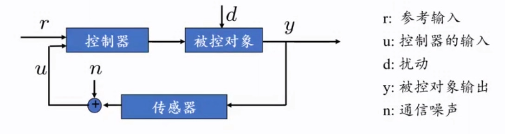
- 上升时间：系统从输入到输出达到稳态值所需的时间
- 稳态误差
- 超调量：峰值超过最终值的百分比
- 校正时间：让响应值与最终值在偏差1%以内的用时

#### 二阶系统控制
状态输入：$x,y \in \pmb{R}$
对象运动学模型：$\ddot{x} = u$
状态$x$去跟随期望轨迹$x^{des}(t)$
定义误差：$e(t) = d^{des}(t) - x(t)$，期望指数收敛到0
找到能满足要求的输入u：
$ \ddot{e} = K_d\dot{e} + K_p e = 0, K_d,K_p > 0 $
$ u(t) = \ddot{x}^{des}(前馈) + K_d \dot{e}(t)(微分) + K_p e(t)(比例) $
- **PD控制**：$u(t) = \ddot{x}^{des} + K_d \dot{e}(t) + K_p e(t)$
- **PID控制**：$u(t) = \ddot{x}^{des} + K_d \dot{e}(t) + K_p e(t) + K_I \int^t_0 e(\tau)d\tau$
    1. 表现效果取决于模型
    2. 需要调节增益参数来获取最佳的效果
- **基于模型控制**：$u(t) = \hat{m}(\ddot{x}^{des} + K_d \dot{e}(t) + K_p e(t)) + \hat{b}\dot{x}(t) + \hat{k}x(t)$
    1. 依赖于模型：取决于模型的精确程度
    2. 独立于模型：伺服控制，增益与模型无关

#### 四旋翼控制
$$
\sum{F_y} = - u_1 \sin{\phi} = m \ddot{y} \\ 
\sum{F_z} = -mg + u_1 \cos{\phi} = m \ddot{z} \\ 
M = u_2 = I_{xx} \ddot{\phi} \\
\begin{bmatrix} \ddot{y} \\ \ddot{z} \\ \ddot{\phi} \end{bmatrix} = 
\begin{bmatrix} 0 \\ -g \\ 0 \end{bmatrix} +
\begin{bmatrix} 
-1/m\sin{\phi} & 0 \\
1/m\cos{\phi} & 0 \\
0 & 1/(I_{xx})
\end{bmatrix}
\begin{bmatrix} u_1 \\ u_2 \end{bmatrix} \\
u_1 = 推力 \quad u_2 = 力矩
$$
- 非线性动力学模型
$\ddot{y} = - {u_1 \over m} \sin{\phi}$
$\ddot{z} = -g + {u_1 \over m} \cos{\phi}$
$\ddot{\phi} = {u_2 \over I_{xx}}$
- 平衡悬停态
$y_0, z_0, \phi_0 = 0$
$u_{1,0} = mg$
$u_{2,0} = 0$
- 线性化模型
$\ddot{y} = -g \phi$
$\ddot{z} = -g + {u_1 \over m}$
$\ddot{\phi} = {u_2 \over I_{xx}}$
**控制回路结构**
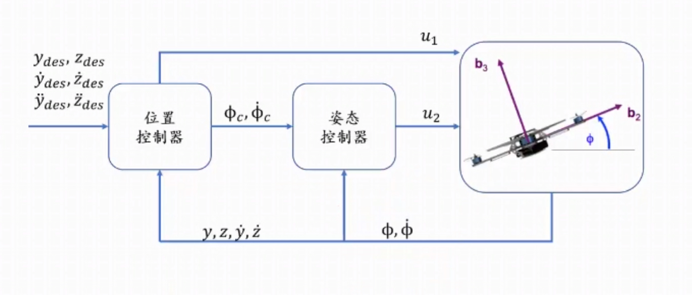
**控制方程组**
1. Z轴方向位置控制
$$
u_1 = m(g + \ddot{z}^{des} + K_{d,z}(\dot{z}^{des} - \dot{z}) + K_{p,z}(z^{des} - z))
$$
>- PD控制：$\ddot{z_c} = \ddot{z}^{des} + K_{d,z}(\dot{z}^{des} - \dot{z}) + K_{p,z}(z^{des} - z)$
>- 模型：$\ddot{z} = -g + {u_1 \over m}$
2. Y轴方向位置控制器
$$
\phi_c = -{1 \over g} (\ddot{y}^{des} + K_{d,y}(\dot{y}^{des} - \dot{y}) + K_{p,y}(y^{des} - y))
$$
>- PD控制：$\ddot{y_c} = \ddot{y}^{des} + K_{d,y}(\dot{y}^{des} - \dot{y}) + K_{p,y}(y^{des} - y)$
>- 模型：$\ddot{y} = -g \phi$
3. 姿态控制器
$$
u_2 = I_{xx} (K_{d,\phi}(\dot{\phi}_c - \dot{\phi}) + K_{p,\phi}(\phi_c - \phi))
$$
>- PD控制：$K_{d,\phi}(\dot{\phi}_c - \dot{\phi}) + K_{p,\phi}(\phi_c - \phi)$
>- 模型：$\ddot{\phi} = {u_2 \over I_{xx}}$

#### 3-D四旋翼控制
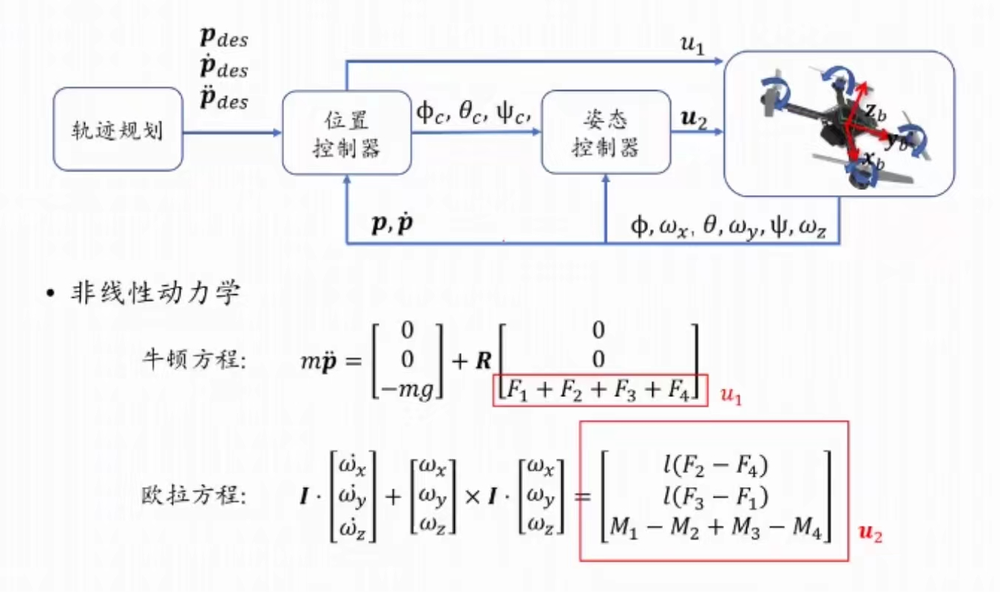
$$
\omega^b = R^T \dot{R} = \begin{bmatrix} p \\ q \\ r \end{bmatrix}
\begin{bmatrix} 
c \theta & 0 & -c \phi s \theta \\ 
0 & 1 & s \phi \\ 
s \theta & 0 & c \phi c \theta 
\end{bmatrix}
\begin{bmatrix} \dot{\phi}_{Roll} \\ \dot{\theta}_{Pitch} \\ \dot{\psi}_{Yaw} \end{bmatrix}
$$
- 平衡悬停态
$\phi_0 = 0$
$\theta_0 = 0$
$u_{1,0} = mg$
- 线性化模型
  - 牛顿方程：
$$
m\ddot{\pmb{p}} = 
\begin{bmatrix} 0 \\ 0 \\ -mg \end{bmatrix} + 
\pmb{R}
\begin{bmatrix} 0 \\ 0 \\ F_1 + F_2 + F_3 + F_4 \end{bmatrix} \\
\pmb{R} =
\begin{bmatrix}
c \psi c \theta & -c \phi s \psi & c \psi s \theta + c \theta s \phi s \psi \\
c \theta s \psi + c \psi s \phi s \theta & c \phi c \psi & s \psi s \theta - c \psi c \theta s \phi \\
-c \phi s \theta & s \phi & c \phi c \theta
\end{bmatrix} \\
\ddot{\pmb{p}}_1 = \ddot{x} = g(\theta \cos{\psi} + \phi \sin{\psi})\\
\ddot{\pmb{p}}_2 = \ddot{y} = g(\theta \sin{\psi} - \phi \cos{\psi})\\
\ddot{\pmb{p}}_3 = \ddot{z} = -g + \ddot{z}_c
$$
  - 欧拉角微分：
$$
\begin{bmatrix} \omega_x \\ \omega_y \\ \omega_z \end{bmatrix} = 
\begin{bmatrix} 
c \theta & 0 & -c \phi s \theta \\ 
0 & 1 & s \phi \\ 
s \theta & 0 & c \phi c \theta 
\end{bmatrix}
\begin{bmatrix} \dot{\phi} \\ \dot{\theta} \\ \dot{\psi} \end{bmatrix}=
\begin{bmatrix} \dot{\phi} \\ \dot{\theta} \\ \dot{\psi} \end{bmatrix}
$$ 
  - 欧拉方程：
$$
\pmb{I} · \begin{bmatrix} \ddot{\phi} \\ \ddot{\theta} \\ \ddot{\psi} \end{bmatrix} + 
\begin{bmatrix} \omega_x \\ \omega_y \\ \omega_z \end{bmatrix} \times \pmb{I} · \begin{bmatrix} \omega_x \\ \omega_y \\ \omega_z \end{bmatrix} =
\begin{bmatrix} l(F_2 - F_4) \\ l(F_3 - F_1) \\ M_1 - M_2 + M_3 - M_4 \end{bmatrix}
$$
**控制方程组**
1. 位置控制
$$
\phi_c = {1 \over g}(\ddot{\pmb{p}}_{1,c} \sin{\psi} - \ddot{\pmb{p}}_{2,c} \cos{\psi})\\
\theta_c = {1 \over g}(\ddot{\pmb{p}}_{1,c} \cos{\psi} + \ddot{\pmb{p}}_{2,c} \sin{\psi})\\
$$
>- PID控制：$\ddot{\pmb{p}}_{i,c} = \ddot{\pmb{p}}_i^{des} + K_{d,i}(\dot{\pmb{p}}_i^{des} - \dot{\pmb{p}}_i) + K_{p,i}(\pmb{p}_i^{des} - \pmb{p}_i)$
>- 模型：$u_1 = m(g + \ddot{\pmb{p}}_{3,c})$
2. 姿态控制
>- PID控制：$
\begin{bmatrix} 
\ddot{\phi}_c \\ \ddot{\theta}_c \\ \ddot{\psi}_c 
\end{bmatrix} = 
\begin{bmatrix} 
K_{p,\phi}(\phi_c - \phi) + K_{p,\phi}(\dot{\phi}_c - \dot{\phi}) \\ 
K_{p,\theta}(\theta_c - \theta) + K_{d,\theta}(\dot{\theta}_c - \dot{\theta}) \\ 
K_{p,\psi}(\psi_c - \psi) + K_{d,\psi}(\dot{\psi}_c - \dot{\psi}) 
\end{bmatrix}$
>- 模型：$
\pmb{u}_2 = \pmb{I} · \begin{bmatrix} \ddot{\phi} \\ \ddot{\theta} \\ \ddot{\psi} \end{bmatrix} + 
\begin{bmatrix} \omega_x \\ \omega_y \\ \omega_z \end{bmatrix} \times \pmb{I} · \begin{bmatrix} \omega_x \\ \omega_y \\ \omega_z \end{bmatrix}$

### 无人机感知算法
感知任务：
   1. **语义感知**
   2. **几何感知**
传感器：单目相机、双目相机、全景相机、单线雷达、多线雷达、RGBD相机

#### 相机模型
$$
\lambda \begin{bmatrix} u \\ v \\ 1 \end{bmatrix} = 
\begin{bmatrix} 
f & 0 & u_0 \\
0 & f & v_0 \\
0 & 0 & 1 
\end{bmatrix}
\begin{bmatrix} 
1 & 0 & 0 & 0 \\
0 & 1 & 0 & 0 \\
0 & 0 & 1 & 0
\end{bmatrix}
\begin{bmatrix} X_c \\ Y_c \\ Z_c \\ 1 \end{bmatrix}
$$
$$
\begin{bmatrix} X_c \\ Y_c \\ Z_c \\ 1 \end{bmatrix} = 
\begin{bmatrix} 
R & t \\
0 & 1
\end{bmatrix}
\begin{bmatrix} X_w \\ Y_w \\ Z_w \\ 1 \end{bmatrix}
$$
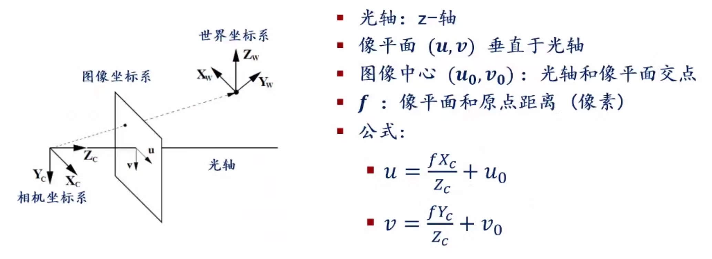

#### 3D-3D位姿估计
**ICP算法**
    1. 初始化R、T为initial guess
    2. 使用当前R、T对pointcloud1中任意一点，找到它在pointcloud2中最近点
    3. 使用上一步得到的数据关联，更新R、T
    4. 重复2、3步，直到收敛
**高斯牛顿法**
    1. $e_i(x + \Delta x) \approx e_i(x) + J_i \Delta x$
    2. $b^T = \sum_i e^T_i \Omega_i J_i$
    3. $H = \sum_i J^T_i \Omega_i J_i$
    4. $\Delta x^* = -H^{-1} b$
    5. $x \leftarrow x + \Delta x^*$
(**最小化二乘法**)
    1. $\Phi(t_x, t_y, \theta) = \sum||y_n - \hat{x_n}||^2 \rightarrow min$
    2. $e_n = \hat{x_n} - y_n = Rx_n + t - y_n$
    3. $e_n(t_x, t_y, \theta) = R(\theta)x_n + \begin{bmatrix} t_x, t_y \end{bmatrix}^T - y_n$
    4. $J_n = \begin{bmatrix} I; R'_{\theta} x_n \end{bmatrix} = 
        \begin{bmatrix}
        1 & 0 & -\sin{\theta}x_n - \cos{\theta}y_n \\
        0 & 1 & \cos{\theta}x_n - \sin{\theta}y_n
        \end{bmatrix}$
    5. $H_n = J^T_n J_n; \space b_n = J^T_n e_n$
    6. $H = \sum_n H_n; \space b = \sum_n b_n$
    7. $H \Delta x = -b \Rightarrow \Delta x = -H^{-1} b$
    8. $x \leftarrow x + \Delta x$ 

#### 地图格式
- **Occupancy Grid Map 栅格地图**
- **OctoMap 八叉树地图**
- **Point Cloud 点云地图**
- **Euclidean Signed Distance Field (ESDF) 欧氏距离场**

###### Occupancy Grid Map 栅格地图
- 将世界空间离散成栅格，每个栅格是刚性的
- 每个栅格被定义为占用或空闲的空间
- 非参数模型，大型地图需要大量内存资源，不依赖特征检测器
$$ 
p(m | z_{1:t},x_{1:t})_{map} = \prod_i p(m_i | z_{1:t},x_{1:t})_{cell}
$$
  1. Bayes rule : ${p(z_t | m_i, z_{1:t-1},x_{1:t}) \cdot p(m_i | z_{1:t-1},x_{1:t}) \over p(z_t | z_{1:t-1},x_{1:t})}$
  2. Markov : ${p(z_t | m_i, x_t) \cdot p(m_i | z_{1:t-1},x_{1:t-1}) \over p(z_t | z_{1:t-1},x_{1:t})}$
  3. Bayes rule : ${p(m_i | z_t, x_t) \cdot p(z_t | x_t) \cdot p(m_i | z_{1:t-1}, x_{1:t-1}) \over p(m_i | x_t) \cdot p(z_t | z_{1:t-1}, x_{1:t})}$
  4. Markov : ${p(m_i | z_t, x_t) \cdot p(z_t | x_t) \cdot p(m_i | z_{1:t-1}, x_{1:t-1}) \over p(m_i) \cdot p(z_t | z_{1:t-1}, x_{1:t})}$
    -  sensor data : $z_{1:t}$
    -  sensor pose : $x_{1:t}$
$$
occupy : p(m | z_{1:t},x_{1:t}) = {p(m_i | z_t, x_t) \cdot p(z_t | x_t) \cdot p(m_i | z_{1:t-1}, x_{1:t-1}) \over p(m_i) \cdot p(z_t | z_{1:t-1}, x_{1:t})} \\
free : p(\neg m | z_{1:t},x_{1:t}) = {p(\neg m_i | z_t, x_t) \cdot p(z_t | x_t) \cdot p(\neg m_i | z_{1:t-1}, x_{1:t-1}) \over p(\neg m_i) \cdot p(z_t | z_{1:t-1}, x_{1:t})} \\
ratio : {p_{occupy} \over p_{free}} = {p(m_i | z_t, x_t) \over 1 - p(m_i | z_t, x_t)} \cdot {p(m_i | z_{1:t-1}, x_{1:t-1}) \over 1 - p(m_i | z_{1:t-1}, x_{1:t-1})} \cdot {1 - p(m_i) \over p(m_i)}
$$
$$
l(m_i | z_{1:t}, x_{1:t}) = l(m_i | z_t, x_t) + l(m_i | z_{1:t-1}, x_{1:t-1} - l(m_i)
$$
    - inverse sensor model : $l(m_i | z_t, x_t)$
    - recurisive term : $l(m_i | z_{1:t-1}, x_{1:t-1}$
    - prior : $l(m_i)$
```python
occupancy_grid_mapping({l_t-1,i}, x_t, z_t):
    for all cells m_i do
        if m_i in perceptual field of z_t then
            l_t,i = l_t-1,i + inv_sensor_model(m_i,x_t,z_t) - l_0
        else
            l_t,i = l_t-1,i - l_0
        endif
    endfor
    return {l_t,i}
```

**Bresenham's Line Algorithm**
$$y = {y_1 - y_0 \over x_1 - x_0}(x - x_0) + y_0$$
```python
bresenham_line(x_0, y_0, x_1, y_1):
    int delta_x = x_1 - x_0
    int delta_y = y_1 - y_0
    real error = 0
    real delta_error = delta_y / delta_x
    int y = y_0
    for x from x_0 to x_1 do
        plot(x, y)
        error += delta_error
        if abs(error) >= 0.5 then
            y += 1
            error -= 1
        endif
    endfor
```

### 无人机路径规划及轨迹生成
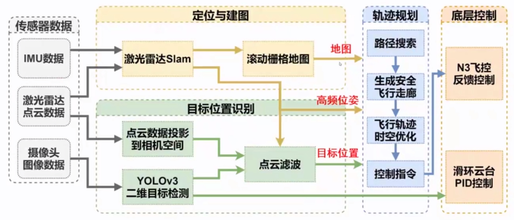
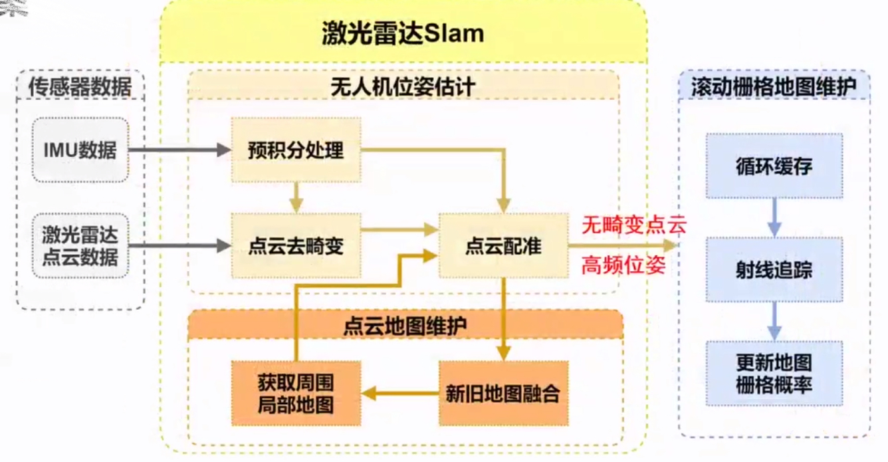
规划：
  - 基本要求
    1. 安全性：躲避障碍物
    2. 光滑性：节省能量、提升运动连续性
    3. 动力学可行性：可执行、可控制
  - 经典链路
    - 前端：**路径搜索**
        1. 搜索初始可行路径
        2. 低纬度问题
        3. 离散空间
    - 后端：**轨迹生成**
        1. 搜索机器人可执行轨迹
        2. 高纬度问题
        3. 连续空间

- **定位模块**：根据传感器实时输入，实现对机器人自身姿态的轨迹，反馈控制模块；定位模块要求精度、一致性、实时性及恶劣环境下的鲁棒性
- **建图模块**：根据传感器信息，实时构建环境三维几何模型，建立地图用于规划中的碰撞检测；建图模块要求地图稠密度、细粒度及建图实时性
- **规划模块**：以机器人实时位姿估计为轨迹起始状态，导航目标为终止状态，生成符合动力学模型，且保证安全性的运动轨迹；规划模块要求生成轨迹的安全性、光滑性、动力学可行性

#### 路径规划
- 搜索过程开始于初始点S
  - 搜索过程会生成一个搜索树
  - 对树中节点逆向搜索可以得到一条路径
  - 构建图的整棵搜索树工作量大且低效，目的是尽快到达目标点
- 维护一个容器来存储所有待访问的节点
- 容器初始化时只存在初始状态$X_s$
- 开始循环：
  - 删除Remove：根据指定的规则从容器中移出一个节点
  - 扩展Expand：得到该节点的所有邻节点
  - 存入Push：将这些邻节点存入容器
- 循环终止条件：
  - 当容器为空或到达目标点时停止；
  - 禁止从容器中移出的节点再次进入容器，避免存在回环

**深度优先搜索(DFS)**
  - 维护一个后进先出的容器：**堆栈**
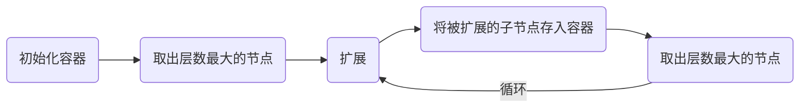
**广度优先搜索(BFS)**
  - 维护一个后进后出的容器：**队列**

**贪婪最佳优先搜索(GBFS)**
  - 维护一个优先队列：**优先级队列**
  - 通过启发式函数取出节点，猜测距离目标远近
    1. 欧式距离
    2. 曼哈顿距离
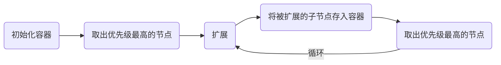

**Dijkstra算法**
  - 策略：每次取出容器中累计代价$g(n)$最小的节点
    - $g(n)$：从初始点到点n的累计代价
    - 更新节点n的所有未拓展邻居m的累计成本$g(m)$
    - 已拓展节点的累计代价应为到起始点的最短路径代价
  - 优点：具有完备性和最优性
  - 缺点：扩展不具有方向性，没有利用到目标点的信息
```python
维护一个存储待扩展节点的优先队列
根据初始状态X_s初始队列
赋值g(X_s)=0，且对于图中其他节点g(n)=无穷
循环：
    如果队列为空，返回False，退出循环
    从优先队列中移出最小g(n)的节点n
    将节点n记作已扩展的节点
    如果节点n是终点，返回True，退出循环
    对于所有未扩展的节点n的邻居节点m：
        如果g(m)=无穷：
            g(m) = g(n) + C_nm
            将节点m压入队列
        如果g(m)>g(n)+C_nm
            g(m) = g(n) + C_nm
结束循环
```
**A*算法**
  - 策略：每次取出容器中具有最小$f(n)$的节点
    - 累计代价：$g(n)$从起始状态到节点n的最小估计代价
    - 启发式函数：$h(n)$从节点到目标点的最小估计代价
    - 从起始状态到目标状态，经过节点n的最小估计代价为$f(n)=g(n)+h(n)$
  - 加权A*算法：$f(n) = g(n) + \epsilon h(n), \epsilon > 1$
```python
维护一个存储待扩展节点的优先队列
根据初始状态X_s初始队列
赋值g(X_s)=0，且对于图中其他节点g(n)=无穷
循环：
    如果队列为空，返回False，退出循环
    从优先队列中移出最小f(n)=g(n)+h(n)的节点n
    将节点n记作已扩展的节点
    如果节点n是终点，返回True，退出循环
    对于所有未扩展的节点n的邻居节点m：
        如果g(m)=无穷：
            g(m) = g(n) + C_nm
            将节点m压入队列
        如果g(m)>g(n)+C_nm
            g(m) = g(n) + C_nm
结束循环
```
**PRM算法**
一种多查询算法，用相对少量的路标点和局部路径来构建一个连接图以得到可行区域的连接情况
- 构建阶段：构建一个表征环境连通情况的路标图
  - 在工作空间采样N个点，删除和环境碰撞的点
  - 连接近邻的节点，删除和环境碰撞的路径段
- 搜索阶段
  - 在构建出的路标连接图中搜索一条起点到终点的路径（Dijkstra、A*）
  - 路标图可近似看作栅格图
  - 可利用路标图进行多次搜索
- 优点：概率完备性
- 缺点：低效，构建连结图但没有专注于产生路径

**RRT算法**
一种单查询算法，通过在工作空间采样节点来构建一棵从起点到终点的树，随着采样增加，树从起点向终点生长
- 在可行空间随机采样
- 找到当前树中离采样点最近的树节点
- 从最近的树节点生长出新的节点和树枝（路径）
- 如果此路径没有和环境发生碰撞，则将此节点和路径加到树中
- 重复n次采样，直到树生长到终点区域
>改进：**RRT*算法**
>- 选择父节点时考虑多个邻近节点
>- 考虑邻近节点的历史路径长度，而非只是局部路径长度
>- 重连接操作，改进局部最优解

>改进：**启发式RRT*算法**
>改进：**动力学RRT*算法**

#### 轨迹生成
轨迹优化的必要性：
  - 机器人的速度和动力学高阶量无法突变
  - 节约机器人运动过程的能量消耗
  - 保证轨迹执行时间的合理性
  - 确保机器人移动过程中的安全

光滑轨迹生成：
  - 边界条件：起始位置、朝向
  - 中间条件：航点位置、朝向，航点由路径规划得到
  - 光滑性标准：通常通过最小化输入的变化率

**光滑一维轨迹**：$5^{th}$多项式轨迹
- 轨迹参数化
$$ x(t) = p_5 t^5 + p_4 t^4 + p_3 t^3 + p_2 t^2 + p_1 t + p_0 $$
- 边界条件

|     | 位置 | 速度 | 加速度 | 
|:---:|:---:|:---:|:---:|
| t=0 | a   | 0   | 0   |
| t=T | b   | 0   | 0   |

- 求解
$$ 
\begin{bmatrix} a \\ b \\ 0 \\ 0 \\ 0 \\ 0 \end{bmatrix} = 
\begin{bmatrix}
0 & 0 & 0 & 0 & 0 & 1 \\ 
T^5 & T^4 & T^3 & T^2 & T & 1 \\ 
0 & 0 & 0 & 0 & 1 & 0 \\ 
5T^4 & 4T^3 & 3T^2 & 2T & 1 & 0 \\
0 & 0 & 0 & 2 & 0 & 0 \\ 
20T^3 & 12T^2 & 6T & 2 & 0 & 0
\end{bmatrix}
\begin{bmatrix} p_5 \\ p_4 \\ p_3 \\ p_2 \\ p_1 \\ p_0 \end{bmatrix} 
$$

**光滑多段一维轨迹**
  - 光滑直线段的转角处
  - 倾向于以v作匀速运动
  - 倾向于零加速度
  - 短的直线段需要特殊处理
  
- 在每个维度上仍使用相同的参数化形式
$$ x(t) = p_5 t^5 + p_4 t^4 + p_3 t^3 + p_2 t^2 + p_1 t + p_0 $$
- 边界条件

|     | 位置 | 速度 | 加速度 | 
|:---:|:---:|:---:|:---:|
| t=0 | a   | $v_0$ | 0 |
| t=T | b   | $v_T$ | 0 |

- 求解
$$ 
\begin{bmatrix} a \\ b \\ v_0 \\ v_T \\ 0 \\ 0 \end{bmatrix} = 
\begin{bmatrix}
0 & 0 & 0 & 0 & 0 & 1 \\ 
T^5 & T^4 & T^3 & T^2 & T & 1 \\ 
0 & 0 & 0 & 0 & 1 & 0 \\ 
5T^4 & 4T^3 & 3T^2 & 2T & 1 & 0 \\
0 & 0 & 0 & 2 & 0 & 0 \\ 
20T^3 & 12T^2 & 6T & 2 & 0 & 0
\end{bmatrix}
\begin{bmatrix} p_5 \\ p_4 \\ p_3 \\ p_2 \\ p_1 \\ p_0 \end{bmatrix} 
$$

**微分平坦**
- 四旋翼状态：$\pmb{X} = \begin{bmatrix} x, y, z, \phi, \theta, \psi, \dot{x}, \dot{y}, \dot{z}, \omega_x, \omega_y, \omega_z \end{bmatrix}^T$
- 平坦输出：$\pmb{\sigma} = \begin{bmatrix} x, y, z, \psi \end{bmatrix}^T$
- 位置、速度、加速度：平坦输出的微分
- 姿态：$\pmb{X}_C = \begin{bmatrix} \cos{\sigma_4}, \sin{\sigma_4}, 0 \end{bmatrix}^T, \pmb{R}_B = \begin{bmatrix} \pmb{x}_B & \pmb{y}_B &  \pmb{y}_B \end{bmatrix}$
- 角速度：$\omega_x = -\pmb{h}_{\omega}·\pmb{y}_B, \omega_y = \pmb{h}_{\omega}·\pmb{x}_B, \omega_z = \dot{\psi} \pmb{z}_{\omega} ·\pmb{z}_B$
- 无人机的路径规划可以在$x,y,z,\psi$中进行

**最小化Snap轨迹生成算法**
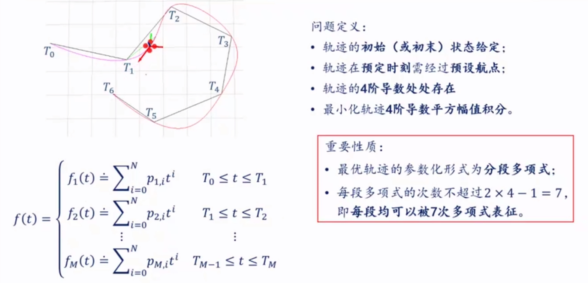
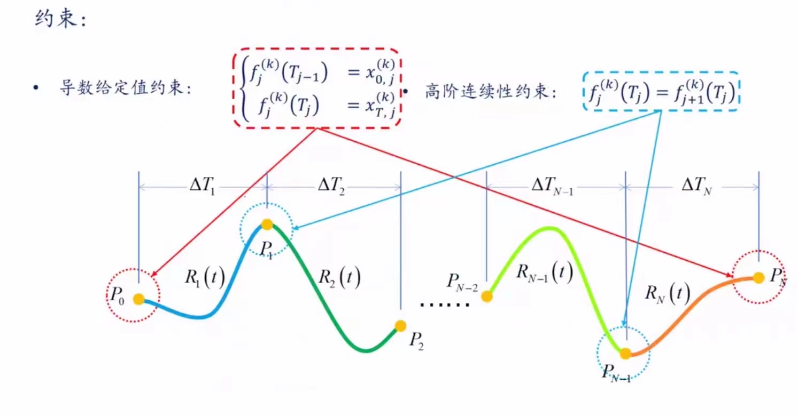
- 方案1：相对每一段初始的时间——优点：数值稳定性高
- 方案2：相对第一段初始的时间——优点：数学表达清楚
<center class="half">
    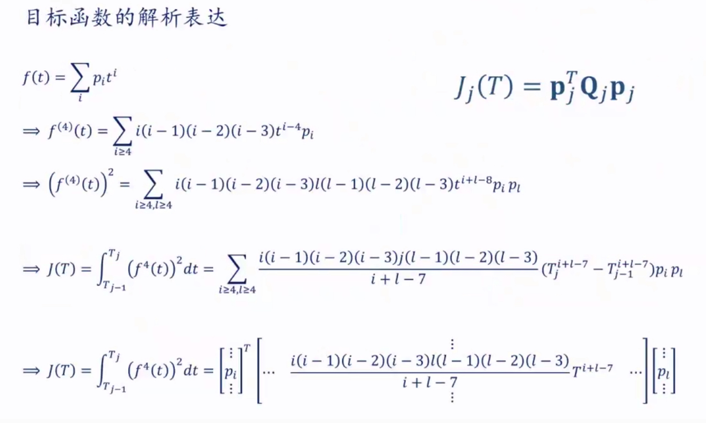
    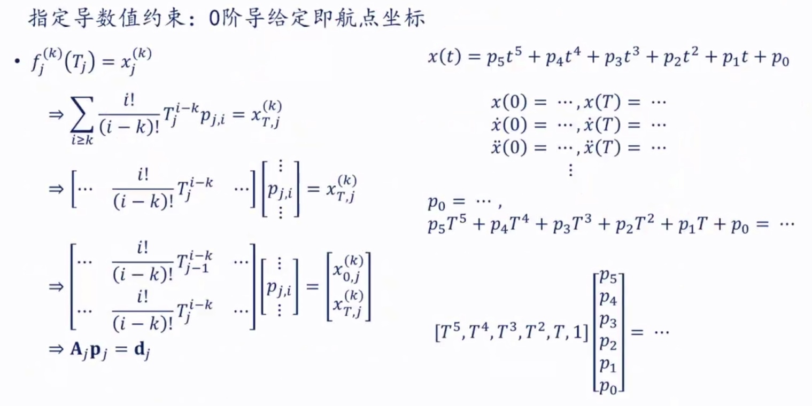
</center>
<center class="half">
    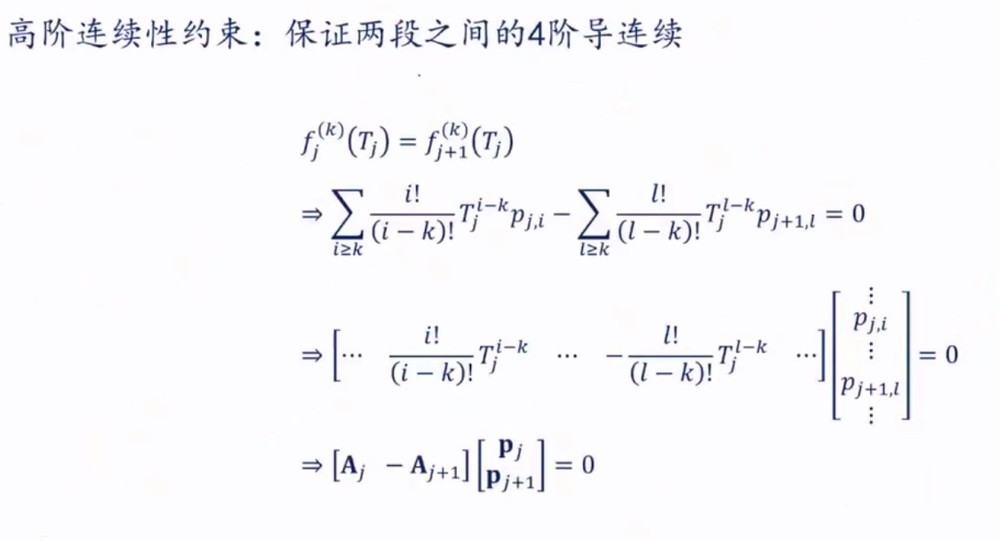
    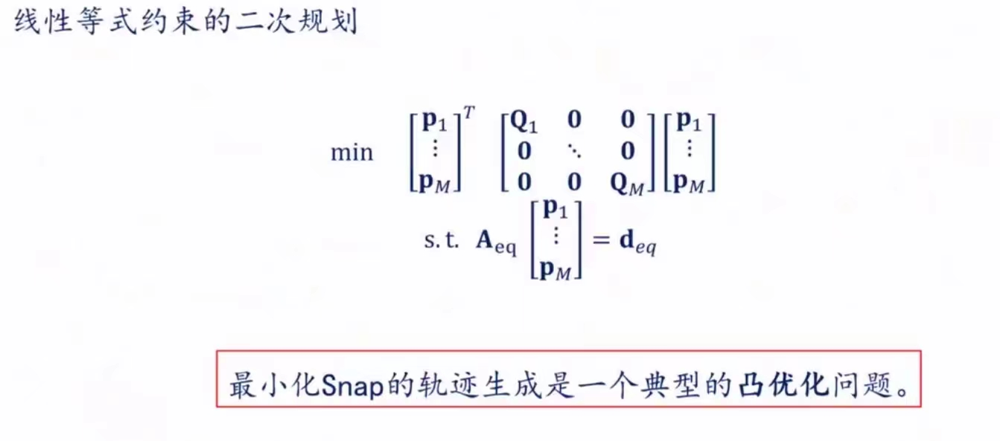
</center>