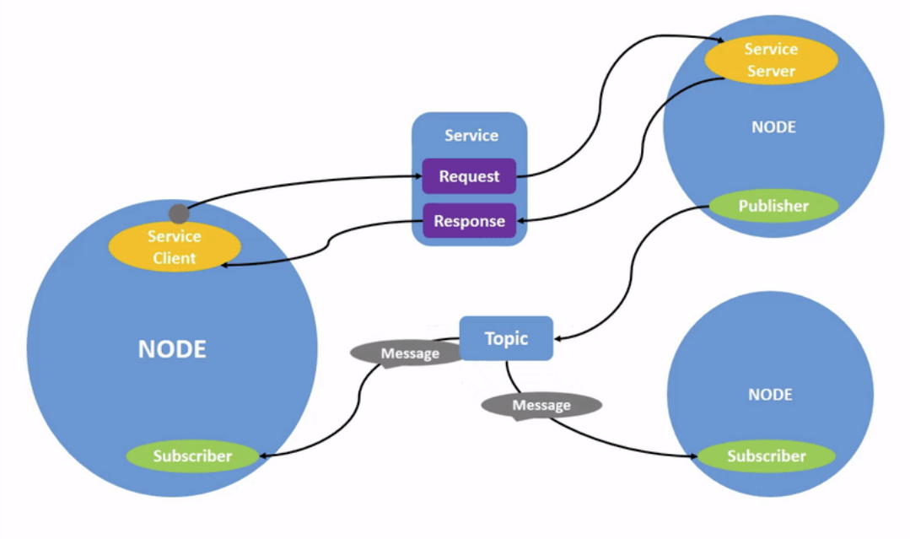
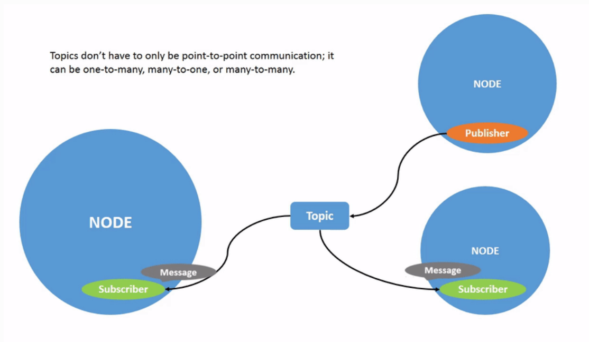
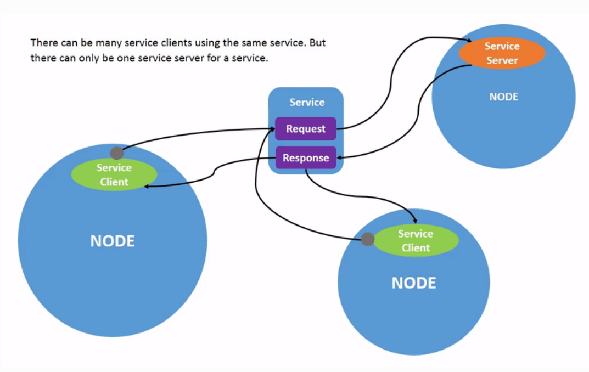
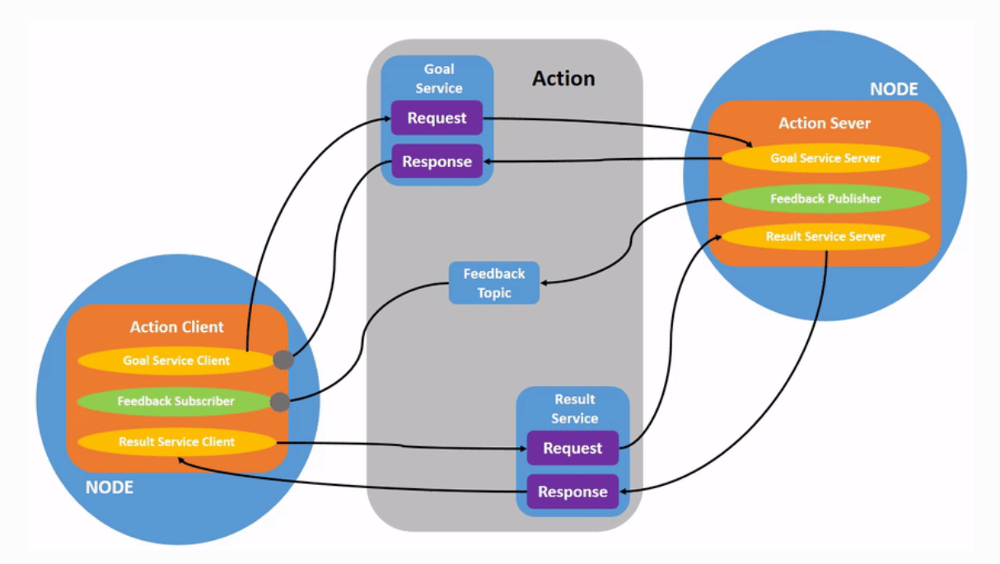

# ROS2 FOXY
###### eiditor: [PEACER]()
[ROS官方文档链接](https://docs.ros.org/en/foxy/)

[1. learn about ROS Node](#1)
  - [1.1 ROS Topic](#1.1)
  - [1.2 ROS Service](#1.2)
  - [1.3 ROS Parameter](#1.3)
  - [1.4 ROS Action](#1.4)

[2. learn about ros2 bag](#2)
[3. start with ros2](#3)
  - [3.1 workspace & package](#3.1)
  - [3.2 publisher & subscriber](#3.2)
  - [3.3 service & client](#3.3)
  - [3.4 create custom msg & srv files](#3.4)
  - [3.5 parameter in class](#3.5)
  - [3.6 creating a plugin](#3.6)
  - [3.7 action server & client](#3.7)

[4. learn about ros2 launch](#4)
[5. learn about ros2 TF2](#5)
[6. learn about ros2 tf2](#6)
  - [6.1 write a static broadcaster](#6.1)
  - [6.2 write a broadcaster](#6.2)
  - [6.3 write a listener](#6.3)
  - [6.4 add a frame](#6.4)
  - [6.5 use and travel in time](#6.5)


## 1. learn about ROS Node

<p id=1></p>

一个完整的机器人系统由许多协同工作的节点组成。
在ROS2中，单个可执行文件（C++程序、Python程序等）可以包含一个或多个节点。
```cli
ros2 run <package_name> <executable_name>
ros2 node list
ros2 node info <node_name>
```

### 1.1 ROS Topic

<p id=1.1></p>

**topic**是在节点之间以及系统的不同部分之间移动数据的主要方式之一
```cli
ros2 topic list (-t)  # -t : 话题的类型
ros2 topic echo <topic_name>
ros2 topic info <topic_name>
ros2 interface show <msg_type>.msg
ros2 topic pub <topic_name> <msg_type> '<args>' #输入YAML格式
# --once: 发布一条消息然后退出
# --rate 1: 以1Hz的稳定流发布命令
ros2 topic hz <topic_name>
```
节点使用消息通过主题发送数据。
发布者和订阅者必须发送和接收相同类型的消息才能进行通信

### 1.2 ROS Service

<p id=1.2></p>

**service**基于呼叫和响应模型,服务只有在客户端专门调用时才提供数据
```cli
ros2 service list (-t)  # -t : 服务的类型
ros2 service type <service_name>
ros2 service find <type_name>
ros2 interface show <srv_type>.srv
ros2 service call <service_name> <service_type> <arguments>
```
服务具有描述服务的请求和响应数据的结构的类型。
服务类型的定义与话题类型类似，服务类型有两部分:
  1. 一部分用于请求
     \---
  2. 另一部分用于响应

### 1.3 ROS Parameter
<p id=1.3></p>

**parameter**是节点的配置值,可以将参数视为节点设置
- 整数(int)
- 浮点值(float,double)
- 布尔值(bool)
- 字符串(string)
- 列表(list)
```cli
ros2 param list
ros2 param get <node_name> <parameter_name>
ros2 param set <node_name> <parameter_name> <parameter_value>
ros2 param dump <node_name>
ros2 param load <node_name> <parameter_file>
ros2 run <package_name> <executable_name> --ros-args --params-file <file_name>
```

### 1.4 ROS Action

<p id=1.4></p>

**action**建立在主题和服务之上,由三部分组成:
  - 目标
  - 反馈
  - 结果
```cli
ros2 action list (-t)  # -t : 动作的类型
ros2 action info <action_name>
ros2 interface show <action_type>.action
ros2 action send_goal <action_name> <action_type> <values>
```
动作类型有三个部分:
  1. 目标
    \---
  2. 结果
    \---
  3. 反馈

## 2. learn about ros2 bag(!ERROR)
<p id=2></p>

是一个命令行工具，用于记录系统中主题发布的数据。它累积在任意数量的主题上传递的数据，并将其保存在数据库中。然后可以回放数据以重现测试和实验的结果。只能记录话题中发布的消息
```cli
ros2 bag record <topic_name>
ros2 bag record -o <bag_file_name> <topic_name1> <topic_name2>
ros2 bag record -a  # all topics
ros2 bag info <bag_file_name>
ros2 bag play <bag_file_name>
```

## 3. start with ros2
<p id=3></p>

### 3.1 workspace & package
<p id=3.1></p>

——workspace: 包含多个package的文件夹
    |__ build:   存储中间文件的位置   
    |__ install: 每个程序包的安装位置
    |__ log:     关于每个colcon调用的各种日志信息
    |__ src:     ROS包的源代码
```cli
source /opt/ros/foxy/setup.bash
mkdir -p <workspace_name>/src
cd <workspace_name>/src

colcon build
    --packages-up-to  : 构建所需的包及其所有依赖项
    --symlink-install : 避免每次调整python脚本时都需要重新构建
    --event-handlers console_direct+ : 显示生成时的控制台输出
colcon test
source install/setup.bash
ros2 run <package_name> <executable_name>
```
>当colcon成功完成构建后，输出将在安装目录中。在使用任何已安装的可执行文件或库之前，您需要将它们添加到路径和库路径中。colcon将在安装目录中生成bash/bat文件，以帮助设置环境。这些文件将把所有必需的元素添加到您的路径和库路径中，并提供包导出的任何bash或shell命令

——CMake pakcage
    |__ CakeLists.txt : 描述如何在包中构建代码
    |__ include/< package_name> : 包含包的公共标头
    |__ package.xml   : 包含有关包的元信息
    |__ src           : 包含包的源代码
```cli
ros2 pkg create --build-type ament_cmake <package_name>
ros2 pkg create --build-type ament_cmake --node-name <node_name> <package_name>
```

### 3.2 publisher & subscriber
<p id=3.2></p>

1. [这是一个发布者的C++示例](./ros2_ws/src/cpp_pubsub/src/publisher.cpp)
2. [这是一个订阅者的C++示例](./ros2_ws/src/cpp_pubsub/src/subscriber.cpp)
3. 修改package.xml
```xml
<!-- 添加依赖项 -->
<depend>rclcpp</depend>
<depend>std_msgs</depend>
```
4. 修改CMakeLists.txt
```CMakeLists.txt
<!-- 添加依赖项 -->
find_package(rclcpp REQUIRED)
find_package(std_msgs REQUIRED)
<!-- 添加可执行文件 -->
# 发布者
add_executable(talker src/talker.cpp)
ament_target_dependencies(talker rclcpp std_msgs)
# 订阅者
add_executable(listener src/subscriber.cpp)
ament_target_dependencies(listener rclcpp std_msgs)
<!-- 安装 -->
install(TARGETS 
  talker 
  listener
  DESTINATION lib/${PROJECT_NAME})
```
5. 测试发布者和订阅者
```cli
# 分开两个终端
colcon build --packages-select <package_name>
source install/setup.bash
ros2 run <package_name> <subscriber_executable_name>
ros2 run <package_name> <publisher_executable_name>
```

### 3.3 service & client
<p id=3.3></p>

1. [这是一个服务端的C++示例](./ros2_ws/src/cpp_srvclt/src/server.cpp)
2. [这是一个客户端的C++示例](./ros2_ws/src/cpp_srvclt/src/client.cpp)
3. 修改package.xml
```xml
<!-- 添加依赖项 -->
<depend>rclcpp</depend>
<depend>example_interfaces</depend>
```
4. 修改CMakeLists.txt
```CMakeLists.txt
<!-- 添加依赖项 -->
find_package(rclcpp REQUIRED)
find_package(example_interfaces REQUIRED)
<!-- 添加可执行文件 -->
# 服务端
add_executable(server src/server.cpp)
ament_target_dependencies(server rclcpp example_interfaces)
# 客户端
add_executable(client src/client.cpp)
ament_target_dependencies(client rclcpp example_interfaces)
<!-- 安装 -->
install(TARGETS 
  server
  client
  DESTINATION lib/${PROJECT_NAME})
```
5. 测试服务端和客户端
```cli
# 分开两个终端
colcon build --packages-select <package_name>
source install/setup.bash
ros2 run <package_name> <server_executable_name>
ros2 run <package_name> <client_executable_name>
```

### 3.4 create custom msg & srv files
<p id=3.3></p>

1. [这是一个msg示例](./ros2_ws/src/tutorial_interfaces/msg/Num.msg)
2. [这是一个msg示例](./ros2_ws/src/tutorial_interfaces/msg/Sphere.msg)
3. [这是一个srv示例](./ros2_ws/src/tutorial_interfaces/srv/AddThreeInts.srv)
4. 修改CMakeLists.txt
```CMakeLists.txt
<!-- 添加依赖项 -->
find_package(geometry_msgs REQUIRED)
find_package(rosidl_default_generators REQUIRED)

rosidl_generate_interfaces(${PROJECT_NAME}
  "msg/Num.msg"
  "msg/Sphere.msg"
  "srv/AddThreeInts.srv"
  DEPENDENCIES geometry_msgs 
#Add packages that above messages depend on)
```
5. 修改package.xml
```xml
<depend>geometry_msgs</depend>
<buildtool_depend>rosidl_default_generators</buildtool_depend>
<exec_depend>rosidl_default_runtime</exec_depend>
<member_of_group>rosidl_interface_packages</member_of_group>
```
>由于接口依赖于```rosidl_default_generator```来生成特定于语言的代码，因此需要声明对它的构建工具依赖关系。
>```rosidl_fault_runtime```是运行时或执行阶段依赖关系，需要能够在以后使用接口。
>```rosidl_interface_packages```是包tutorial_interfaces应该与之关联的依赖组的名称，使用```<member_of_group>```标记声明。
6. 测试自定义接口
```cli
colcon build --packages-select tutorial_interfaces
source install/setup.bash
ros2 interface show <package_name>/msg/<interface_name>
ros2 interface show <package_name>/srv/<interface_name>
```

### 3.5 parameter in class
<p id=3.5></p>

1. [这是一个参数的C++示例](./ros2_ws/src/cpp_parameters/src/parameter.cpp)
2. 修改CMakeLists.txt
```CMakeLists.txt
<!-- 添加可执行文件 -->
add_executable(param src/parameter.cpp)
ament_target_dependencies(param rclcpp)
<!-- 安装 -->
install(TARGETS
  param
  DESTINATION lib/${PROJECT_NAME})
```
3. 测试参数
```cli
colcon build --packages-select cpp_parameters
source install/setup.bash
ros2 run cpp_parameters param
<!-- 打开另一个终端 -->
ros2 param list
ros2 param set /my_param my_parameter earth
```

### 3.6 creating a plugin
<p id=3.6></p>

>pluginlib 是一个 C++ 库，用于从 ROS 包中加载和卸载插件。 插件是从运行时库（即共享对象、动态链接库）加载的可动态加载类。 使用 pluginlib，人们不必将他们的应用程序显式链接到包含类的库——相反，pluginlib 可以在任何时候打开包含导出类的库，而无需应用程序事先了解库或包含类定义的头文件。 插件可用于扩展/修改应用程序行为，而无需应用程序源代码。

1. **定义基类**
   ```cli
    ros2 pkg create --build-type ament_cmake polygon_base --dependencies pluginlib --node-name area_node
  ``` 
  - [C++抽象类定义](./ros2_ws/src/polygon_base/include/polygon_base/regular_polygon.hpp) 
  - 修改CMakeLists.txt
```CMakeLists.txt
install(
  DIRECTORY include/
  DESTINATION include
  )
ament_export_include_directories(include)
```
2. **提供插件**
  ```cli
  ros2 pkg create --build-type ament_cmake polygon_plugins --dependencies polygon_base pluginlib --library-name polygon_plugins
  ```
  - [C++插件定义](./ros2_ws/src/polygon_plugins/src/polygon_plugins.cpp)
  - [创建plugins.xml](./ros2_ws//src/polygon_plugins//plugins.xml)
    > 1、该标签提供了包含我们要导出的插件的库的相对路径
    > 2、该标签声明了我们想要从库中导出的插件 
       >- type: 插件的完全限定类型
       >- base_class: 插件的完全限定基类类型
       >- description: 插件及其功能的描述
  - 修改CMakeLists.txt
```CMakeLists.txt
add_library(polygon_plugins src/polygon_plugins.cpp)
target_include_directories(polygon_plugins PUBLIC
  $<BUILD_INTERFACE:${CMAKE_CURRENT_SOURCE_DIR}/include>
  $<INSTALL_INTERFACE:include>)
ament_target_dependencies(
  polygon_plugins
  "polygon_base"
  "pluginlib"
)

pluginlib_export_plugin_description_file(polygon_base plugins.xml)
<!-- 1. 具有基类的包-->
<!-- 2. 插件声明 xml 的相对路径-->

install(
  TARGETS polygon_plugins
  EXPORT export_${PROJECT_NAME}
  ARCHIVE DESTINATION lib
  LIBRARY DESTINATION lib
  RUNTIME DESTINATION bin
)

ament_export_libraries(
  polygon_plugins
)
ament_export_targets(
  export_${PROJECT_NAME}
)
```
3. **使用插件**
[使用插件(可以在任何包中完成)](./ros2_ws/src/polygon_base/src/area_node.cpp)
4. 测试插件
```cli
colcon build --packages-select polygon_base polygon_plugins
source install/setup.bash
ros2 run polygon_base area_node
```

### 3.7 action server & client
<p id=3.7></p>

1. [这是一个action示例](./ros2_ws/src/tutorial_interfaces/action/Fibonacci.action)
> \# Request  :从操作客户端发送到启动新目标的操作服务器
> \---
> \# Result   :目标完成后从操作服务器发送到操作客户端
> \---
> \# Feedback :定期从操作服务器发送到操作客户端包含有关目标的更新
- 修改CMakeLists.txt
```CMakeLists.txt
<!-- 添加依赖项 -->
find_package(rosidl_default_generators REQUIRED)
rosidl_generate_interfaces(${PROJECT_NAME}
  "action/Fibonacci.action"
)
```
- 修改package.xml
```xml
<!-- 添加依赖项 -->
<buildtool_depend>rosidl_default_generators</buildtool_depend>
<depend>action_msgs</depend>
<member_of_group>rosidl_interface_packages</member_of_group>
```
- 编译测试
```cli
colcon build
source install/setup.bash
ros2 interface show <package_name>/action/<interface_name>
```
>action是ROS中异步通信的一种形式。操作客户端将目标请求发送到操作服务器,操作服务器将目标反馈和结果发送给操作客户端
```cli
ros2 pkg create --dependencies action_tutorials_interfaces rclcpp rclcpp_action rclcpp_components -- cpp_action
```
1. [这是一个action server的C++示例](./ros2_ws/src/cpp_action/src/action_server.cpp)
2. [这是一个action client的C++示例](./ros2_ws/src/cpp_action/src/action_client.cpp)
3. 修改CMakeLists.txt
```CMakeLists.txt
# server
add_library(action_server SHARED
  src/action_server.cpp)
target_include_directories(action_server PRIVATE
  $<BUILD_INTERFACE:${CMAKE_CURRENT_SOURCE_DIR}/include>
  $<INSTALL_INTERFACE:include>)
target_compile_definitions(action_server PRIVATE
  "ACTION_TUTORIALS_CPP_BUILDING_DLL")
ament_target_dependencies(action_server
  "rclcpp"
  "rclcpp_action"
  "rclcpp_components"
  "tutorial_interfaces")
rclcpp_components_register_node(action_server 
  PLUGIN "ActionCpp::FibonacciActionServer"
  EXECUTABLE fibonacci_action_server)
INSTALL(TARGETS
  action_server
  ARCHIVE DESTINATION lib
  LIBRARY DESTINATION lib
  RUNTIME DESTINATION bin)

# client
add_library(action_client SHARED
  src/action_client.cpp)
target_include_directories(action_client PRIVATE
  $<BUILD_INTERFACE:${CMAKE_CURRENT_SOURCE_DIR}/include>
  $<INSTALL_INTERFACE:include>)
target_compile_definitions(action_client PRIVATE
  "ACTION_TUTORIALS_CPP_BUILDING_DLL")
ament_target_dependencies(action_client
  "rclcpp"
  "rclcpp_action"
  "rclcpp_components"
  "tutorial_interfaces")
rclcpp_components_register_node(action_client 
  PLUGIN "ActionCpp::FibonacciActionClient"
  EXECUTABLE fibonacci_action_client)
INSTALL(TARGETS
  action_client
  ARCHIVE DESTINATION lib
  LIBRARY DESTINATION lib
  RUNTIME DESTINATION bin)
```
4. 测试action server和client
```cli
# 分开两个终端
colcon build --packages-select <package_name>
source install/setup.bash
ros2 run <package_name> <server_register_name>
ros2 run <package_name> <client_register_name>
```

## 4. learn about ros2 launch
<p id=4></p>

##### 创建一个启动文件
```cli
ros2 pkg create <package_name> --build-type ament_cmake
```
[这是一个launch文件示例](./ros2_ws/src/ws_bringup/launch/test_bringup.py)
1. 修改CMakeLists.txt
```CMakeLists.txt
install(
  DIRECTORY launch
  DESTINATION share/${PROJECT_NAME}
  )
```
2. 修改package.xml
```xml
<exec_depend>launch</exec_depend>
<exec_depend>ros2launch</exec_depend>
```
3. 测试launch文件
```cli
colcon build --packages-select <package_name>
source install/setup.bash
ros2 launch <package_name> <launch_file_name>
rqt_graph
```

##### 使用substitutions
可以在参数中使用替换，以便在描述可重用的启动文件时提供更大的灵活性
[这是一个launch父启动文件示例](./ros2_ws/src/ws_bringup/launch/ex_main.launch.py)
[这是一个launch替换启动文件示例](./ros2_ws/src//ws_bringup/launch/ex_substitution.launch.py)(#TODO)
测试launch文件
```cli
colcon build
source install/setup.bash
ros2 launch ws_bringup ex_main.launch.py (--show-args)
ros2 launch ws_bringup ex_main.launch.py turtlesim_ns:='turtlesim3' use_provided_red:='True' new_background_r:=200
```

##### 使用event handlers
在ROS2中启动是一个执行和管理用户定义流程的系统。它负责监视其启动的进程的状态，以及报告和响应这些进程状态的变化。这些更改称为事件，可以通过向启动系统注册事件处理程序来处理。事件处理程序可以注册特定事件，可用于监视进程状态。此外，它们还可用于定义一组复杂的规则，这些规则可用于动态修改启动文件。
[这是一个launch父启动文件示例](./ros2_ws/src/ws_bringup/launch/ex_main.launch.py)
测试launch文件
```cli
colcon build
source install/setup.bash
ros2 launch ws_bringup ex_eventhandler.launch.py turtlesim_ns:='turtlesim3' use_provided_red:='True' new_background_r:=200
```


