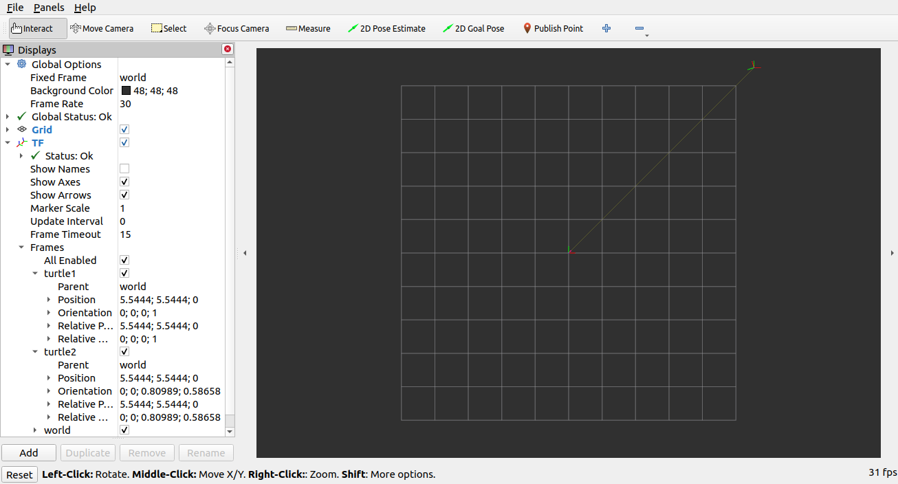

# ROS2 TF2
###### eiditor: [PEACER]()
[ROS官方文档链接](https://docs.ros.org/en/foxy/Tutorials/Intermediate/Tf2/Introduction-To-Tf2.html)

- [1. write a static broadcaster](#1)
- [2. write a broadcaster](#2)
- [3. write a listener](#3)
- [4. add a frame](#4)
- [5. use and travel in time](#5)

## learn about ROS2 TF2

##### 使用view_frames
tf2侦听器侦听通过ROS广播的框架,并绘制框架连接方式的树
```cli
ros2 run tf2_tools view_frames.py
```
[frames.pdf](./tf2_bag/frames.pdf)

##### 使用tf2_echo
显示通过ROS广播的任意两框架之间的转换
```cli
ros2 run tf2_ros tf2_echo [source_frame] [target_frame]
```
##### RVIZ
一种可视化工具，可用于检查TF2框架
```cli
ros2 run rviz2 rviz2 -d $(ros2 pkg prefix --share turtle_tf2_py)/rviz/turtle_rviz.rviz
```


### 1. write a static broadcaster
<p id=1></p>

发布静态变换可用于定义机器人底座与其**非移动部件**之间的关系
```cli
ros2 pkg create <package_name> --build-type ament_cmake --dependencies geometry_msgs rclcpp tf2 tf2_ros turtlesim
```
package.xml中的依赖已经在创建包的时候加入
1. [这是一个tf2静态广播器的示例](./tf2_ws/src/tf2_cpp/src/static_broadcaster.cpp)
2. 修改CMakeLists.txt
```CMakeLists.txt
# 添加可执行文件
add_executable(static_tf2_broadcaster src/static_roadcaster.cpp)
ament_target_dependencies(static_tf2_broadcaster
  geometry_msgs
  rclcpp
  tf2
  tf2_ros)
# 安装
install(TARGETS
  static_tf2_broadcaster
  DESTINATION lib/${PROJECT_NAME})
```
3. 测试静态广播器
```cli
colcon build --packages-select <package_name>
source install/setup.bash
ros2 run <package_name> <node_name> mystaticturtle 0 0 1 0 0 0
# 
ros2 topic list
ros2 topic echo --qos-reliability reliable --qos-durability transient_local /tf_static
```
> 使用专用的``tf2_ros``工具来实现,``tf2_ros``提供了一个名为``statictransform_publisher``的可执行文件,它既可以用作命令行工具,也可以用作可以添加到启动文件中的节点
- x/y/z 偏移（米）
- 滚动/俯仰/偏航（弧度）
- 四元数
```cli
ros2 run tf2_ros static_transform_publisher x y z yaw pitch roll frame_id child_frame_id    #滚动/俯仰/偏航    
ros2 run tf2_ros static_transform_publisher x y z qx qy qz qw frame_id child_frame_id   #四元数
```
[这是一个launch文件示例](./tf2_ws/src/tf2_cpp/launch/tf2_static_broadcast_launch.py)

### 2. write a broadcaster
<p id=2></p>

1. [这是一个tf2广播器的示例](./tf2_ws/src/tf2_cpp/src/broadcaster.cpp)
2. 修改CMakeLists.txt
```CMakeLists.txt
# 添加可执行文件
add_executable(turtle_tf2_broadcaster src/turtle_tf2_broadcaster.cpp)
ament_target_dependencies(turtle_tf2_broadcaster
  geometry_msgs
  rclcpp
  tf2
  tf2_ros
  turtlesim)
# 安装
install(TARGETS
  turtle_tf2_broadcaster
  DESTINATION lib/${PROJECT_NAME})
```
3. 使用launch启动并测试静态广播器
[这是相关的launch文件](./tf2_ws/src/tf2_cpp/launch/turtle_tf2_demo.launch.py)
```cli
colcon build --packages-select <package_name>
source install/setup.bash
ros2 launch <package_name> <launch_file_name>
ros2 run tf2_ros tf2_echo <parent_frame> <child_frame>
```

### 3. write a listener
<p id=3></p>

1. [这是一个tf2监听器的示例](./tf2_ws/src/tf2_cpp/src/listener.cpp)
2. 修改CMakeLists.txt
```CMakeLists.txt
add_executable(tf2_listener src/listener.cpp)
ament_target_dependencies(tf2_listener
    geometry_msgs
    rclcpp
    tf2
    tf2_ros
    turtlesim)
install(TARGETS
    tf2_listener
    DESTINATION lib/${PROJECT_NAME})
```
3. [更新之后的launch文件](./tf2_ws/src/tf2_cpp/launch/turtle_tf2_demo.launch.py)
4. 测试
```cli
colcon build
source install/setup.bash
ros2 launch <package_name> <launch_file_name>
ros2 run turtlesim turtle_teleop_key
```

### 4. add a frame
<p id=4></p>

##### TF2 Tree
>tf2构建了一个框架的树结构，因此不允许框架结构中存在闭环。这意味着一个框架只有一个父框架，但可以有多个子框架。
- 1
1. [静态框架广播器](./tf2_ws/src/tf2_cpp/src/add_broadcaster.cpp)
2. 修改CMakeLists.txt
```CMakeLists.txt
add_executable(fixed_frame_broadcaster src/add_broadcaster.cpp)
ament_target_dependencies(fixed_frame_broadcaster
    geometry_msgs
    rclcpp
    tf2_ros)
install(TARGETS
    fixed_frame_broadcaster
    DESTINATION lib/${PROJECT_NAME})
```
3. [编写新的launch文件](./tf2_ws/src/tf2_cpp/launch/)
4. 测试
```cli
colcon build --packages-select <package_name>
source install/setup.bash
ros2 launch <package_name> <launch_file_name>
ros2 run tf2_ros tf2_echo <parent_frame> <child_frame>
ros2 launch tf2_cpp fixed_tf2_tree.launch.py target_frame:=carrot1
```
- 2
1. [动态框架广播器](./tf2_ws/src/tf2_cpp/src/add_broadcaster.cpp)
2. 修改CMakeLists.txt
```CMakeLists.txt
add_executable(dynamic_frame_broadcaster src/add_broadcaster.cpp)
ament_target_dependencies(dynamic_frame_broadcaster
    geometry_msgs
    rclcpp
    tf2_ros)
install(TARGETS
  dynamic_frame_broadcaster
  DESTINATION lib/${PROJECT_NAME})
```
3. [编写新的launch文件](./tf2_ws/src/tf2_cpp/launch/)
4. 测试
```cli
colcon build --packages-select <package_name>
source install/setup.bash
ros2 launch <package_name> <launch_file_name>
```

### 5. use and travel in time
<p id=5></p>

[有关time的相关教程](http://fishros.org/doc/ros2/humble/Tutorials/Intermediate/Tf2/Learning-About-Tf2-And-Time-Cpp.html)
>缓冲区的工作原理:首先，每个监听器都有一个缓冲区，用于存储来自不同tf2广播器的所有坐标转换。其次，当广播器发送一个转换时，需要一些时间才能将该转换放入缓冲区（通常需要几毫秒）。因此，当您在“现在”时间请求帧转换时，您应该等待几毫秒，以便该信息到达。

```c++
rclcpp::Time now = this->get_clock()->now();
rclcpp::Time when = now - rclcpp::Duration(5, 0);
t = tf_buffer_->lookupTransform(
    toFrameRel,       //目标框架
    now,              //进行转换的时间
    fromFrameRel,     //源框架
    when,             //进行转换的时间   
    "world",          //世界系（随时间不变的框架）
    50ms);            //等待目标框架可用的时间
```
